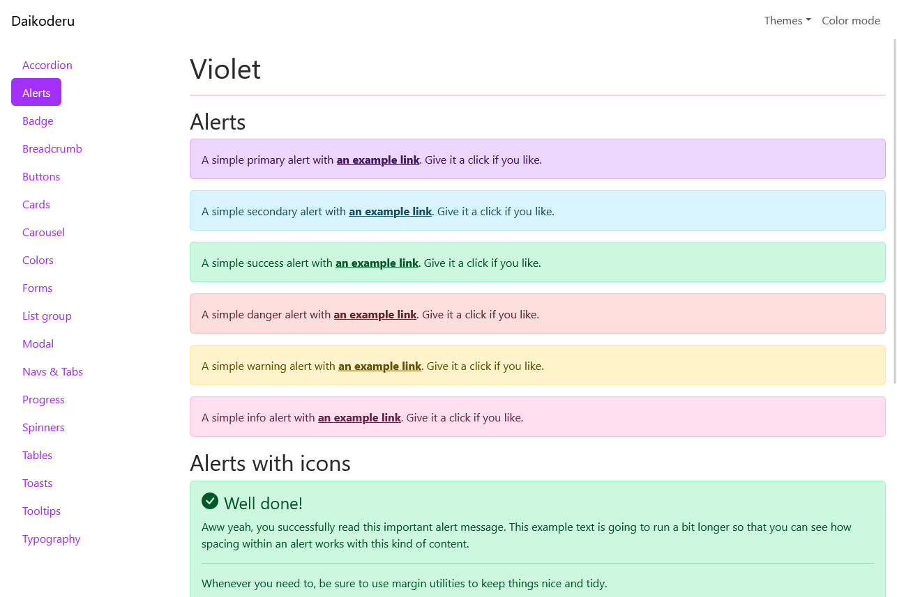
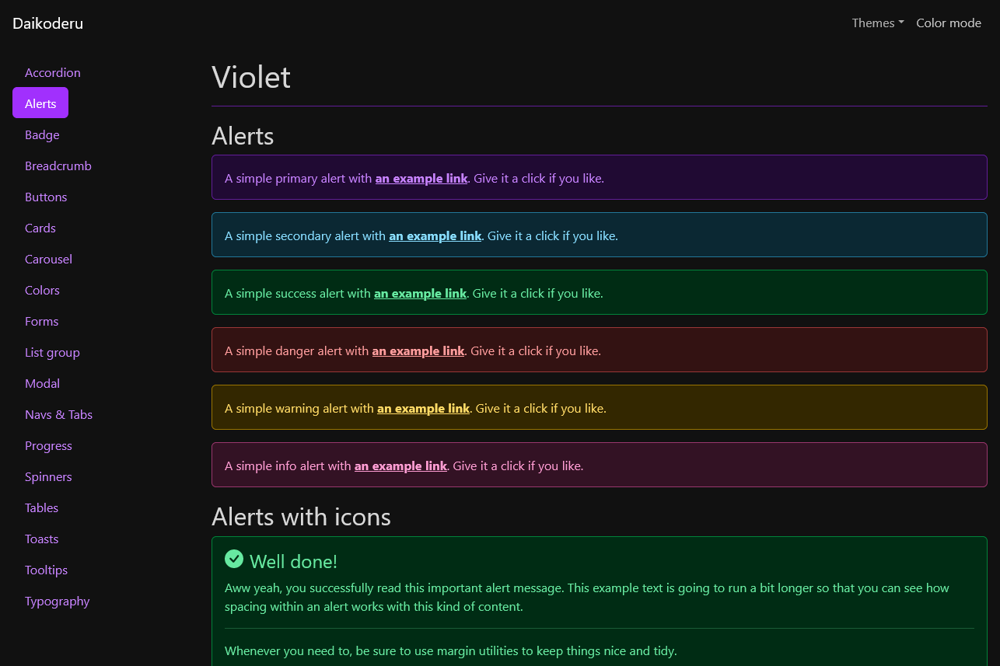
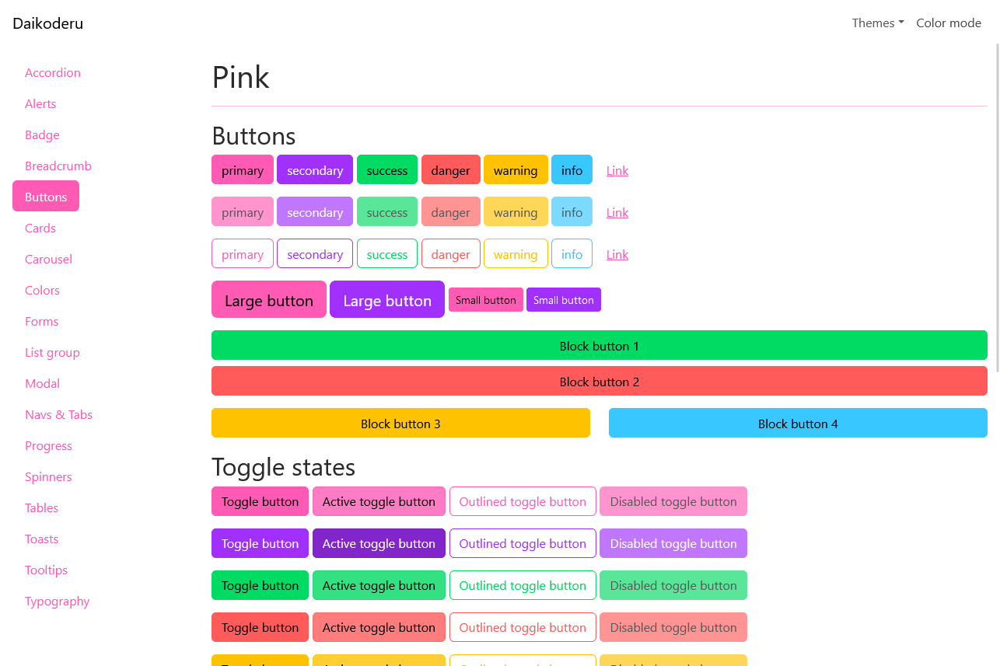
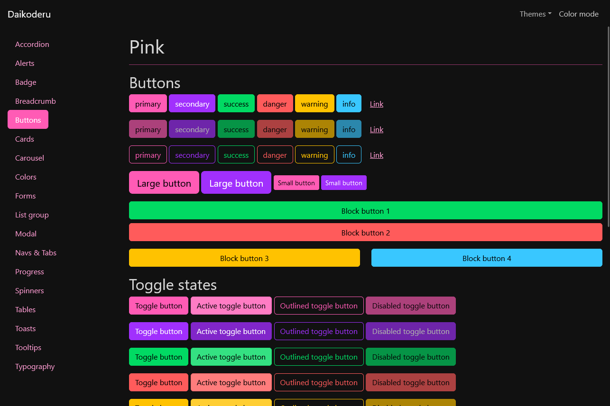
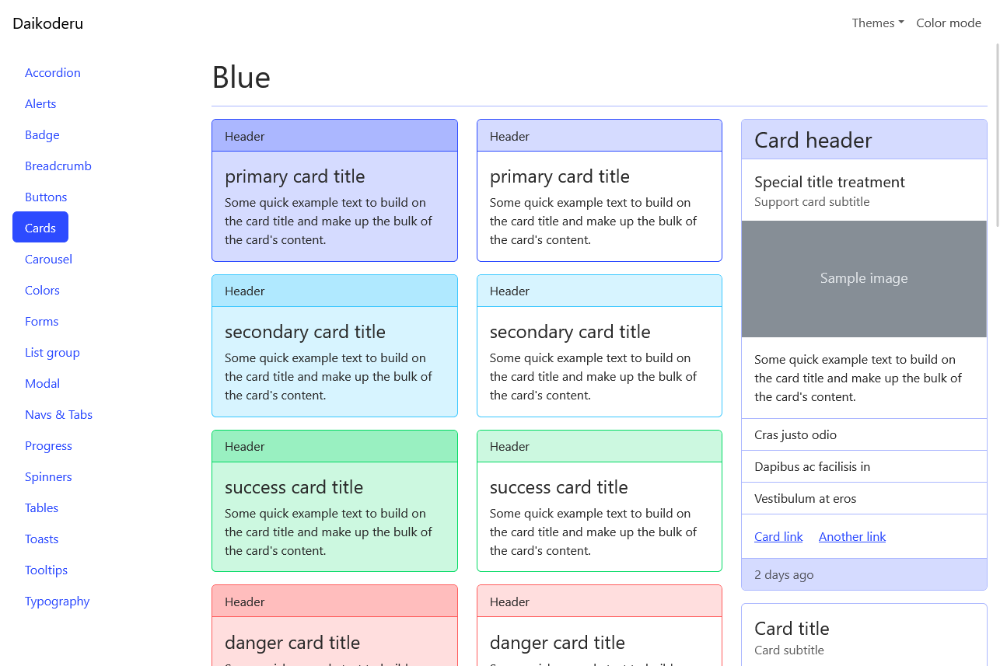
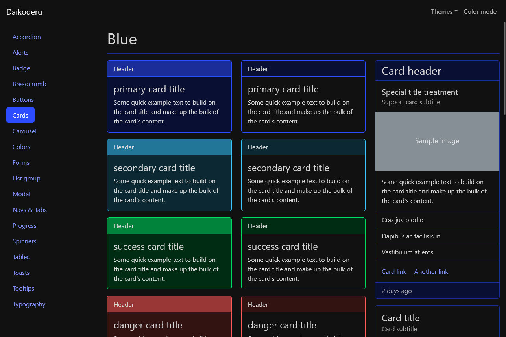
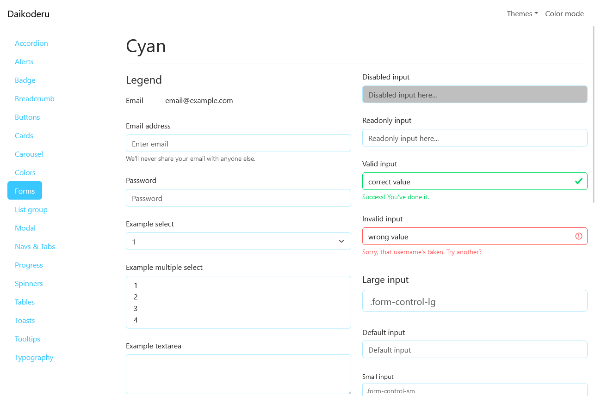
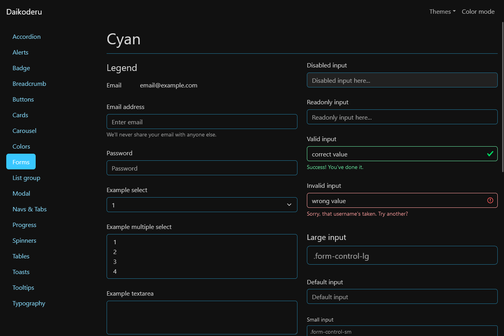
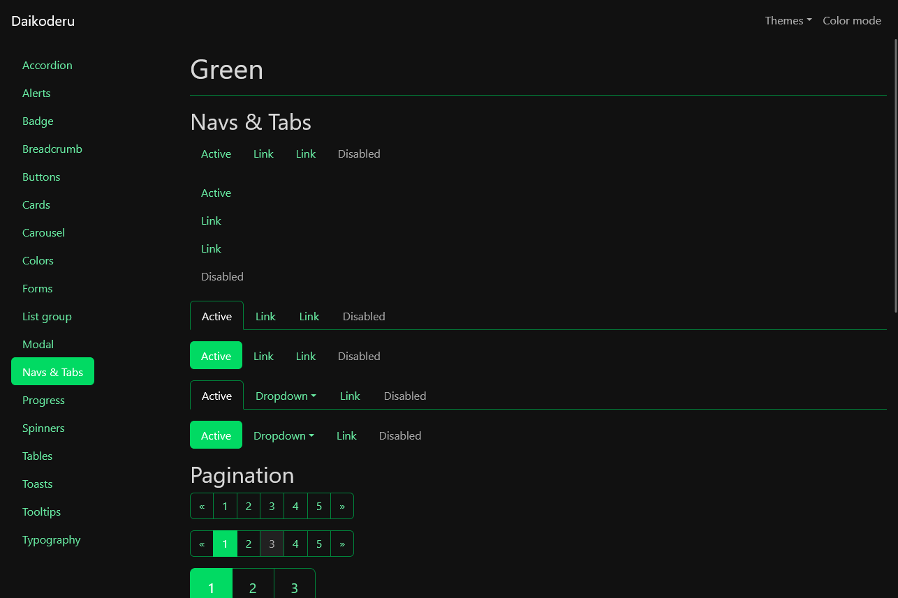
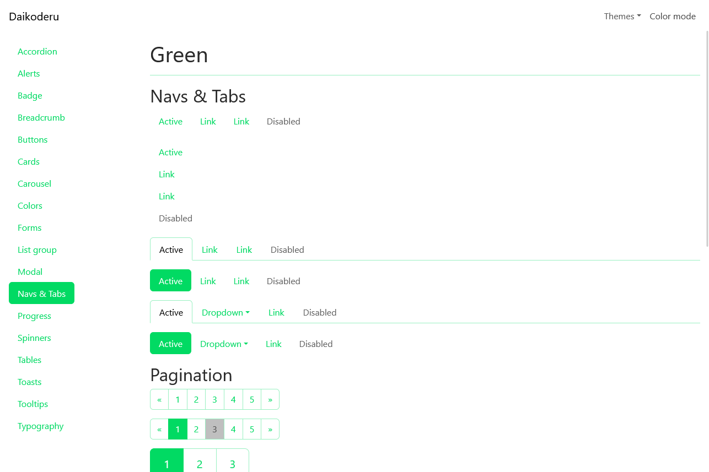

# Daikoderu's Theme Collection

This is a collection of Bootstrap themes that I made for my personal projects.
All of them are freely available for use in any project and can be previewed
by launching the Node.js project contained in this repository.

This project is inspired by [Bootswatch](https://bootswatch.com/).

Available themes at the moment for versions `1.x` (compatible with Bootstrap `>=5.3`):

*   `violet`

    

    

*   `pink`

    

    

*   `blue`

    

    

*   `cyan`

    

    

*   `green`

    

    


Available themes for versions `0.x` (for older `5.x` versions of Bootstrap):

*   `violet-light`
*   `violet-dark`
*   `blue-light`
*   `blue-dark`
*   `cyan-light`
*   `cyan-dark`
*   `green-light`
*   `green-dark`


## Using the themes

You can find my themes in the `sass` and `css` folders or install them into your Node.js
project. Bootstrap `5.3` or later is required

```
npm install bootstrap-daikoderu-themes
```

If you are using Bootstrap older `5.x` versions of Bootstrap, the newer `1.x` themes will not be compatible.
You can use instead the `0.x` version.

```
npm install bootstrap-daikoderu-themes@^0.2.0
```

### With React

Add the corresponding files in your JavaScript:

```js
import 'bootstrap-daikoderu-themes/<theme-name>/bootstrap.min.css';
```


## Previewing the themes

This project includes a Express server to help you preview the themes. Just follow these steps:

1.  Clone or download this repository.
2.  Install dependencies:

    ```
    npm install
    ```

3.  Run with:

    ```
    npm run preview
    ```
    
4.  Open http://localhost:8080 to start previewing!


## Adding or modifying themes

Use this import stack as a template to create your own theme:

```scss
// 1. Include functions first (so you can manipulate colors, SVGs, calc, etc).
@import "node_modules/bootstrap/scss/functions";

// 2. Include any default variable overrides here.

// 3. Include remainder of required Bootstrap stylesheets (including any separate color mode stylesheets).
@import "node_modules/bootstrap/scss/variables";
@import "node_modules/bootstrap/scss/variables-dark";

// 4. Include any default map overrides here.

// 5. Include the rest of Bootstrap.
@import "node_modules/bootstrap-daikoderu-themes/scss/common/bootstrap-components"
```

In order for this setup to work, you'll need to tell Sass to include the `node_modules` folder's parent directory as a load path.
