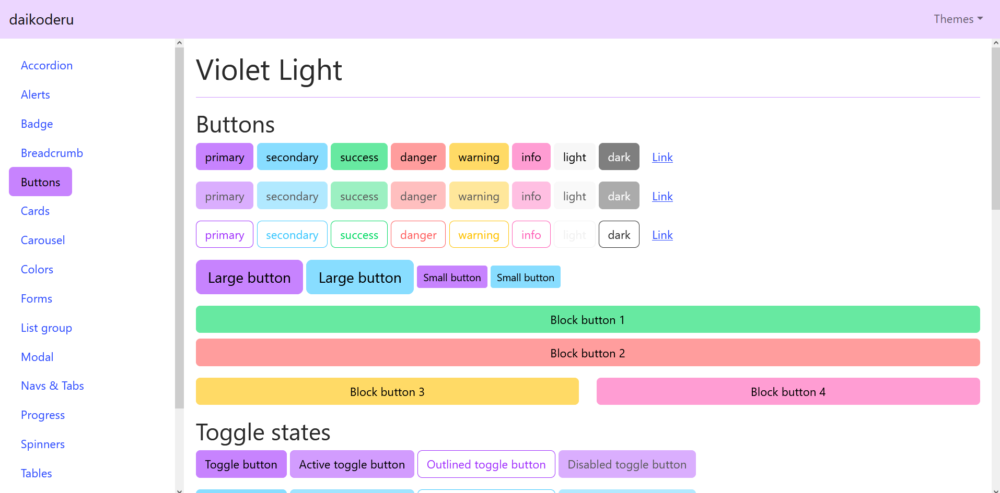
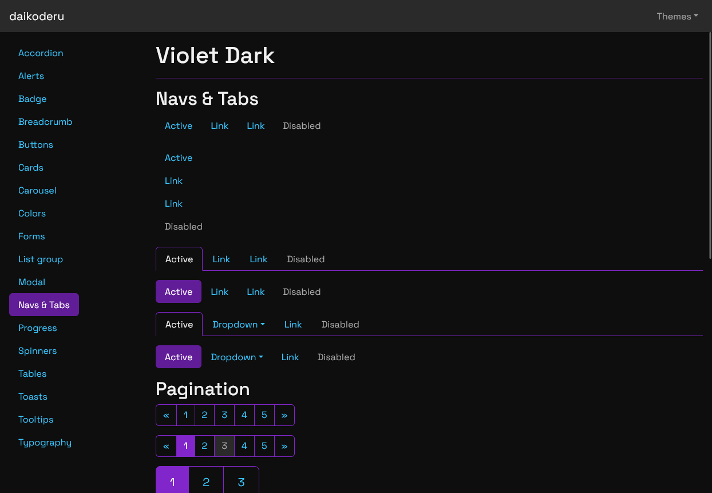
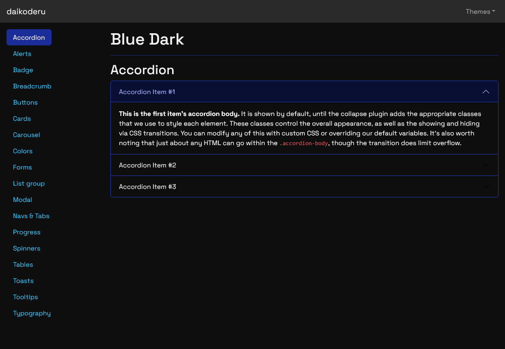

# Daikoderu's Theme Collection

This is a collection of Bootstrap themes that I made for my personal projects.
All of them are freely available for use in any project and can be previewed
by launching the Node.js project contained in this repository.

This project is inspired by [Bootswatch](https://bootswatch.com/).








Available themes at the moment:

*   `violet-light`
*   `violet-dark`
*   `blue-light`
*   `blue-dark`
*   `cyan-light`
*   `cyan-dark`
*   `green-light`
*   `green-dark`


## Using the themes

You can find my themes in the `sass` and `css` folders or install them into your Node.js
project:

```
npm install bootstrap-daikoderu-themes
```

The latest supported version of Bootstrap is 5.2. Due to the changes introduced in Bootstrap 5.3
regarding variables, `bootstrap-daikoderu-themes` does not support Bootstrap 5.3 and later at
the moment.

### With React

Import the corresponding file in your JavaScript:

```
import 'bootstrap-daikoderu-themes/<theme-name>/bootstrap.min.css';
```


## Previewing the themes

This project includes a Express server to help you preview the themes. Just follow these steps:

1.  Clone or download this repository.
2.  Install dependencies:

    ```
    npm install
    ```

3.  Run with:

    ```
    npm run preview
    ```
    
4.  Open http://localhost:8080 to start previewing!


## Adding or modifying themes.

Use this import stack as a template to create your own theme:

```scss
@import "node_modules/bootstrap/scss/mixins/banner";
@include bsBanner("");


// Import Bootstrap functions first
@import "node_modules/bootstrap/scss/functions";

// Configuration
@import "<your-customizations-here>";

// Import the rest of Bootstrap
@import "node_modules/bootstrap-daikoderu-themes/common/bootstrap-components";

// Override some styles (optional)
@import "node_modules/bootstrap-daikoderu-themes/common/overrides";
```

The included themes share values for different colors, and then include theme-specific
stylesheets. For example:

```scss
@import "common/basic-colors";
@import "colors/green-dark";
```

This way you can create theme families with both common and distinct properties 
while reducing repetition when declaring your variables across variations.
However, it's up to you how you organize your styles.

Once you've made changes, just call `npm run css-build <theme-name>` from your
command line to get the resulting CSS file.
